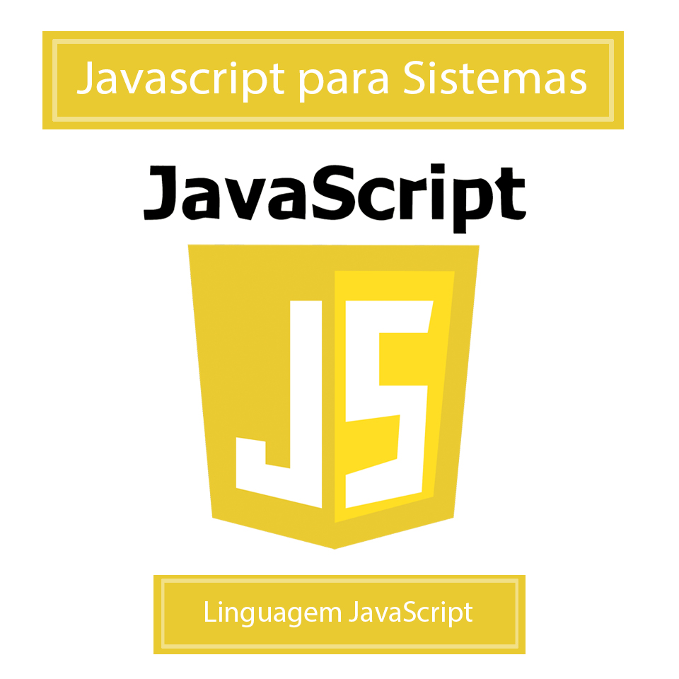

# hugo-javascript
Repositório do Curso de Javascript da escola Hugo Vasconcellos

[Link do Curso](https://hugocursos.com.br/curso-de-javascript-para-sistemas)

Projeto

## Descrição:

O curso de JavaScript para Sistemas possui 40 aulas, neste curso você vai aprender diversos recursos interessantes para aplicação do javascript, jquery e ajax nos seus sistemas, vamos fazer exemplos de dois selects para listagens de dados onde ao selecionar um valor ele busca o segundo, vamos fazer diversos tipos de buscas com retornos em inputs, tabelas, divs, vamos fazer cadastros com múltiplas abas, utilização de checkbox, radio button, máscaras, funções de tempo e intervalo e muito mais, tudo que você precisa dominar para aplicar em seus projetos de forma profissional.

  

